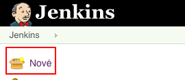

# Build project using Jenkins

This recipe describes how to setup Jenkins to automatically build project and deploy it to GS bucket. 
It consists of few steps made in Jenkins, Gitlab & repository.

## Add Jenkinsfile to project

Take the content below and put it to file called `Jenkinsfile` located in root of your repository.

```
PipelineReact {
  slackChannel = '#ci-web'
  buildCommand = [
      development: 'npm install && npm test && npm run build:dev',
      master:      'npm install && npm test && npm run build:prod',
  ]
  buildDir = 'build'
  
  baseURL = 'template-react'
  bucketURL = [
      master:      "gs://${baseURL}.ack.ee/",
      development: "gs://${baseURL}-development.ack.ee/",
      stage:       "gs://${baseURL}-stage.ack.ee/"
  ]

  cloudProject = [
      development: 'infrastruktura-1307',
      master:      'ackee-production',
  ]

  nodeEnv = '-e NODE_PATH=./app:./config'
  nodeImage = 'node:6'
  excludeDir = '.git'
}
```

### Config fields

**PipelineReact** - Name of function in groovy script which manages the pipeline.

### Change these fields for project

* **slackChannel** - Set name of Slack channel for sending build result into. Create project specific channel (eg. `#ci-petshare`) or left default `#ci-web` channel - but it's not recommended.  

* **buildCommand** - Add set of terminal commands that will run on build trigger.  

* **baseURL**, **beucketURL** - Git branches that are required to build and adresses to deploy them.

* **cloudProject** - Id of cloud project where branch is deployed. Ask DevOps for these.

### Change these if you need

* **build** - Folder where pipeline will look for built project files and use them for deploy.

* **nodeImage** - Name of docker image which will be used as a build environment.

## Create new job

1. Open https://jenkinsaurora.ack.ee/ in your browser.

2. Press **Nové** button in top left corner.  
 

3. Fill then first input field with your project name.

4. Now there are two options to create job
   * Create multipipeline branch from the scratch by clicking **Multibranch pipeline**.  
     

   * Recommended way is to create it by cloning existing job and changing few settings (you can use eg. `abibuch/abibuch-editor-frontend` job). Just scroll to the bottom of page and fill the "Copy from" field with name of job you want to clone. 
    

5. After confirm and getting to job configuration page, change the field **Project repository**. Then setup branches which will be scanned for changes by writing their names (separated by single space) into **Behaviours -> Discover branches -> Include** field, eg. `master development stage`.
 

6. Decide if `master` branch should been build automatically or only by manual triggering, it's __Supress automatic SCM triggering__ option.  
   

## Setup weboohok

Build webhook URL by replacing **GROUP_NAME/REPOSITORY_NAME** with your project's Gitlab group and repository name in followring URL pattern:  

`http://jenkinsaurora.ack.ee/git/notifyCommit?url=git@gitlab.ack.ee:GROUP_NAME/REPOSITORY_NAME.git`  

For example, if you have `https://gitlab.com/Web/awesome-project`, then the wehook URL is `http://jenkinsaurora.ack.ee/git/notifyCommit?url=git@gitlab.ack.ee:Web/awesome-project.git`.

In gitlab repository go to **Settings -> Integration** page and field the URL field with hook adress from previous step, then click Add webhook and check **Enable SSL verification** option is checked.
   


